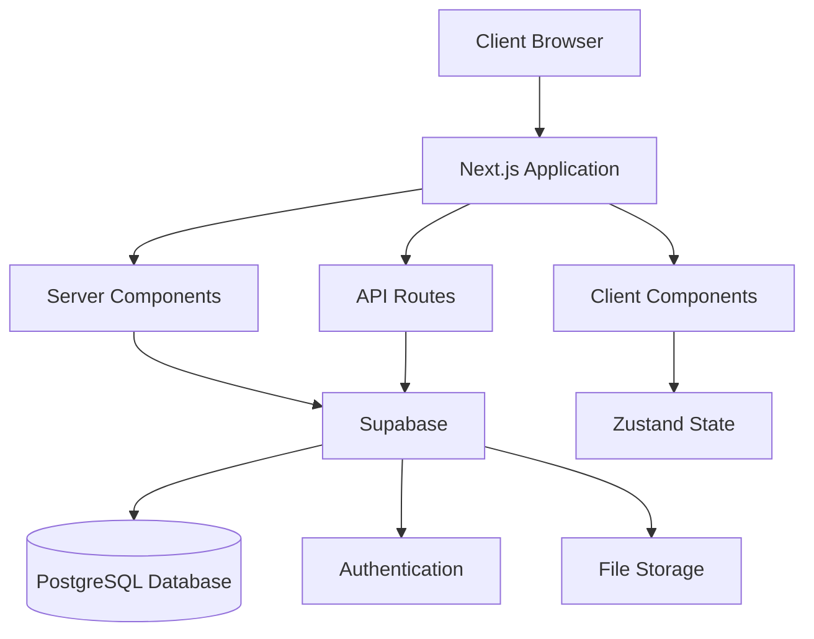
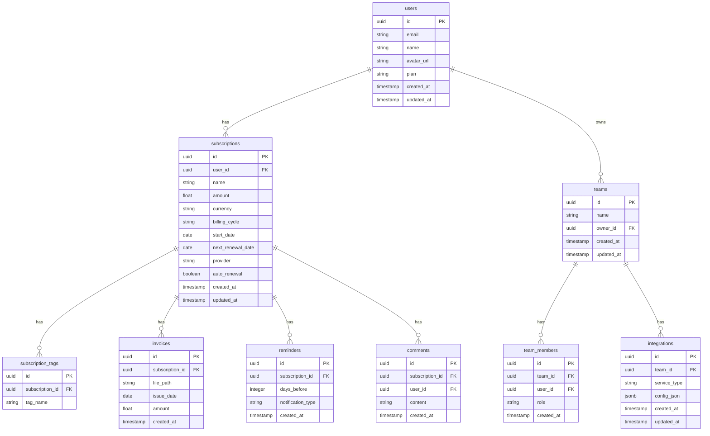

# Design Document

## Overview

The Subscription Tracker is a full-stack Next.js application designed to help individuals and organizations manage their recurring subscriptions efficiently. This document outlines the technical design and architecture of the application, based on the requirements specified in the requirements document.

The application will be built using a modern tech stack including Next.js, TypeScript, Tailwind CSS, Shadcn UI, and Supabase. It will follow a tiered service model with Basic, Pro, and Team plans, each offering progressively more advanced features.

## Architecture

### System Architecture

The Subscription Tracker follows a full-stack architecture using Next.js App Router, with both frontend and backend components integrated into a single codebase:



### Key Architectural Decisions

1. **Next.js App Router**: Using the latest Next.js App Router for improved routing, layouts, and server components
2. **Server Components**: Leveraging React Server Components for improved performance and reduced client-side JavaScript
3. **API Routes**: Implementing backend functionality through Next.js API routes
4. **Supabase**: Using Supabase for authentication, database, and storage needs
5. **Zustand**: Implementing client-side state management with Zustand for its simplicity and performance
6. **TypeScript**: Ensuring type safety throughout the application
7. **Tailwind CSS & Shadcn UI**: Implementing a consistent design system with utility-first CSS

## Components and Interfaces

### Core Components

#### Authentication System

The authentication system will be built using Supabase Auth with Google OAuth as the authentication method:

```typescript
// lib/supabase/auth.ts
import { createClientComponentClient } from '@supabase/auth-helpers-nextjs';

export const signInWithGoogle = async () => {
  const supabase = createClientComponentClient();
  const { data, error } = await supabase.auth.signInWithOAuth({
    provider: 'google',
    options: {
      redirectTo: `${window.location.origin}/auth/callback`,
    },
  });
  
  return { data, error };
};
```

#### Plan-Based Access Control

A central feature access control system will determine which features are available based on the user's subscription plan:

```typescript
// lib/plans/features.ts
export type PlanType = 'basic' | 'pro' | 'team';

export const FEATURES = {
  subscription_management: ['basic', 'pro', 'team'],
  csv_import_export: ['basic', 'pro', 'team'],
  advanced_analytics: ['pro', 'team'],
  invoice_management: ['pro', 'team'],
  custom_reminders: ['pro', 'team'],
  calendar_view: ['pro', 'team'],
  team_collaboration: ['team'],
  integrations: ['team'],
};

export const hasAccess = (userPlan: PlanType, feature: keyof typeof FEATURES): boolean => {
  return FEATURES[feature].includes(userPlan);
};
```

#### Subscription Manager

The core subscription management component will handle CRUD operations for subscriptions:

```typescript
// lib/subscriptions/manager.ts
import { SubscriptionType } from '../types';
import { supabaseClient } from '../supabase/client';

export const createSubscription = async (subscription: Omit<SubscriptionType, 'id' | 'user_id' | 'created_at' | 'updated_at'>) => {
  const { data, error } = await supabaseClient
    .from('subscriptions')
    .insert([{ ...subscription }])
    .select();
  
  return { data, error };
};

// Additional CRUD operations...
```

#### Analytics Dashboard

The analytics dashboard will provide visualizations and reports based on subscription data:

```typescript
// components/dashboard/AnalyticsDashboard.tsx
import { useSubscriptions } from '@/lib/hooks/useSubscriptions';
import { BarChart, LineChart, PieChart } from '@/components/ui/charts';

export const AnalyticsDashboard = ({ period = 'month' }) => {
  const { subscriptions, isLoading } = useSubscriptions();
  
  // Process subscription data for visualizations
  const { totalMRR, totalYRR, categoryBreakdown, trends } = processAnalyticsData(subscriptions, period);
  
  return (
    <div className="grid grid-cols-1 md:grid-cols-2 lg:grid-cols-3 gap-4">
      <Card>
        <CardHeader>
          <CardTitle>Total MRR</CardTitle>
        </CardHeader>
        <CardContent>
          <div className="text-2xl font-bold">${totalMRR}</div>
        </CardContent>
      </Card>
      
      {/* Additional analytics components */}
    </div>
  );
};
```

### Interface Definitions

#### Core Data Types

```typescript
// lib/types/index.ts
export type UserType = {
  id: string;
  email: string;
  name: string;
  plan: 'basic' | 'pro' | 'team';
  created_at: string;
};

export type SubscriptionType = {
  id: string;
  user_id: string;
  name: string;
  amount: number;
  currency: string;
  billing_cycle: 'monthly' | 'quarterly' | 'annual' | 'custom';
  start_date: string;
  next_renewal_date: string;
  provider: string;
  auto_renewal: boolean;
  tags: string[];
  created_at: string;
  updated_at: string;
};

export type InvoiceType = {
  id: string;
  subscription_id: string;
  file_path: string;
  issue_date: string;
  amount: number;
  created_at: string;
};

export type ReminderType = {
  id: string;
  subscription_id: string;
  days_before: number;
  notification_type: 'email' | 'slack' | 'discord';
  created_at: string;
};

// Additional types for Team plan features
export type TeamType = {
  id: string;
  name: string;
  owner_id: string;
  created_at: string;
  updated_at: string;
};

export type TeamMemberType = {
  id: string;
  team_id: string;
  user_id: string;
  role: 'admin' | 'viewer';
  created_at: string;
};

export type CommentType = {
  id: string;
  subscription_id: string;
  user_id: string;
  content: string;
  created_at: string;
};

export type IntegrationType = {
  id: string;
  team_id: string;
  service_type: 'slack' | 'discord';
  config_json: Record<string, any>;
  created_at: string;
  updated_at: string;
};
```

#### API Interfaces

The application will implement RESTful API endpoints as defined in the API specification document. Here's an example of the subscription API interface:

```typescript
// app/api/v1/subscriptions/route.ts
import { NextResponse } from 'next/server';
import { createRouteHandlerClient } from '@supabase/auth-helpers-nextjs';
import { cookies } from 'next/headers';

export async function GET(request: Request) {
  const { searchParams } = new URL(request.url);
  const limit = searchParams.get('limit') || '20';
  const offset = searchParams.get('offset') || '0';
  const sort = searchParams.get('sort') || 'next_renewal_date';
  const order = searchParams.get('order') || 'asc';
  const tag = searchParams.get('tag');
  const search = searchParams.get('search');
  
  const supabase = createRouteHandlerClient({ cookies });
  
  // Verify authentication
  const { data: { session } } = await supabase.auth.getSession();
  if (!session) {
    return NextResponse.json({ error: { code: '401', message: 'Unauthorized' } }, { status: 401 });
  }
  
  // Build query
  let query = supabase
    .from('subscriptions')
    .select('*')
    .eq('user_id', session.user.id)
    .order(sort, { ascending: order === 'asc' })
    .range(parseInt(offset), parseInt(offset) + parseInt(limit) - 1);
  
  if (tag) {
    query = query.contains('tags', [tag]);
  }
  
  if (search) {
    query = query.ilike('name', `%${search}%`);
  }
  
  const { data, error, count } = await query.select('*', { count: 'exact' });
  
  if (error) {
    return NextResponse.json({ error: { code: '500', message: error.message } }, { status: 500 });
  }
  
  return NextResponse.json({
    data,
    meta: {
      total: count,
      limit: parseInt(limit),
      offset: parseInt(offset)
    }
  });
}

export async function POST(request: Request) {
  // Implementation for creating a subscription
}
```

## Data Models

### Database Schema

The application will use a PostgreSQL database through Supabase with the following schema:



### Data Access Layer

The application will use Supabase client libraries to interact with the database:

```typescript
// lib/supabase/client.ts
import { createClient } from '@supabase/supabase-js';

const supabaseUrl = process.env.NEXT_PUBLIC_SUPABASE_URL!;
const supabaseAnonKey = process.env.NEXT_PUBLIC_SUPABASE_ANON_KEY!;

export const supabaseClient = createClient(supabaseUrl, supabaseAnonKey);
```

## Error Handling

### Error Handling Strategy

The application will implement a comprehensive error handling strategy:

1. **Client-Side Error Handling**:
   - Form validation using React Hook Form and Zod
   - API error handling with Axios interceptors
   - Global error boundary components

2. **Server-Side Error Handling**:
   - Structured error responses from API routes
   - Logging of server-side errors
   - Graceful fallbacks for database errors

3. **User Feedback**:
   - Toast notifications for success/error messages
   - Inline form validation errors
   - Fallback UI components for failed data fetching

### Error Response Format

All API errors will follow a consistent format:

```typescript
// types/api.ts
export type ApiError = {
  error: {
    code: string;
    message: string;
    details?: Record<string, any>;
  };
};

// Example error handling in API route
if (error) {
  return NextResponse.json({
    error: {
      code: '422',
      message: 'Validation error',
      details: error.details
    }
  }, { status: 422 });
}
```

## Testing Strategy

### Testing Approach

The application will implement a comprehensive testing strategy:

1. **Unit Testing**:
   - Testing individual components and functions
   - Using Jest and React Testing Library
   - Focus on business logic and utility functions

2. **Integration Testing**:
   - Testing component interactions
   - API route testing with mocked database
   - Authentication flow testing

3. **End-to-End Testing**:
   - Critical user flows testing
   - Using Playwright or Cypress
   - Testing across different browsers and devices

### Test Structure

```
__tests__/
├── unit/
│   ├── components/
│   ├── hooks/
│   └── utils/
├── integration/
│   ├── api/
│   └── pages/
└── e2e/
    └── flows/
```

### Example Test

```typescript
// __tests__/unit/utils/subscription.test.ts
import { calculateNextRenewalDate, calculateMRR } from '@/lib/utils/subscription';

describe('Subscription Utilities', () => {
  describe('calculateNextRenewalDate', () => {
    it('should calculate monthly renewal correctly', () => {
      const startDate = new Date('2023-01-15');
      const cycle = 'monthly';
      
      const result = calculateNextRenewalDate(startDate, cycle);
      
      expect(result.toISOString().split('T')[0]).toBe('2023-02-15');
    });
    
    // Additional tests...
  });
  
  describe('calculateMRR', () => {
    it('should calculate MRR for monthly subscriptions', () => {
      const subscription = {
        amount: 10,
        billing_cycle: 'monthly',
      };
      
      const result = calculateMRR(subscription);
      
      expect(result).toBe(10);
    });
    
    it('should calculate MRR for annual subscriptions', () => {
      const subscription = {
        amount: 120,
        billing_cycle: 'annual',
      };
      
      const result = calculateMRR(subscription);
      
      expect(result).toBe(10);
    });
    
    // Additional tests...
  });
});
```

## Security Considerations

### Authentication and Authorization

- Using Supabase Auth for secure authentication
- JWT-based authentication for API routes
- Role-based access control for team features
- Plan-based feature access control

### Data Protection

- HTTPS for all communications
- Encryption of sensitive data in the database
- Secure file storage for invoices and documents
- Input validation and sanitization to prevent injection attacks

### API Security

- Rate limiting to prevent abuse
- CORS policies to restrict access to approved domains
- Input validation on all endpoints
- Authentication token validation for protected routes

## Performance Considerations

### Frontend Performance

- Server Components for improved initial load time
- Client Components only where interactivity is needed
- Image optimization with Next.js Image component
- Code splitting and lazy loading for large components

### Backend Performance

- Efficient database queries with proper indexing
- Caching strategies for frequently accessed data
- Pagination for large data sets
- Optimized API responses

### Database Performance

- Proper indexing on frequently queried fields
- Efficient relationship design
- Connection pooling
- Query optimization

## Deployment and Infrastructure

### Deployment Strategy

- Vercel for Next.js application hosting
- Supabase for database and authentication
- CI/CD pipeline with GitHub Actions
- Environment-specific configurations

### Infrastructure Requirements

- Vercel hosting plan appropriate for expected traffic
- Supabase plan with sufficient database and storage capacity
- Domain name and SSL certificate
- Monitoring and logging solutions

## Conclusion

This design document outlines the technical architecture and implementation approach for the Subscription Tracker application. The design follows modern web development practices and leverages the capabilities of Next.js, TypeScript, and Supabase to create a scalable, maintainable, and user-friendly application.

The tiered service model (Basic, Pro, Team) is integrated into the core architecture, allowing for flexible feature access based on the user's subscription plan. The application is designed to be extensible, allowing for future features and improvements to be added with minimal changes to the core architecture.